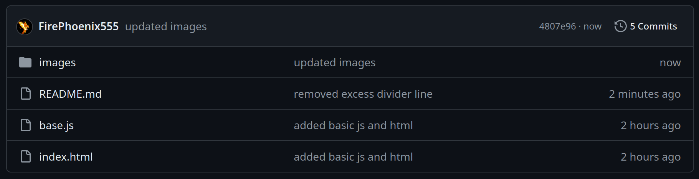

# beginners-js-tutorial

## What is this?
If you're used to programming on Khan Academy (i.e. [this environment](https://www.khanacademy.org/computer-programming/new/pjs)) or the [online p5js editor](https://editor.p5js.org/), and you want to move past those environments (e.g. to increase the canvas size, as I did), this tutorial should help bridge the gap between the JavaScript in those environments and the JavaScript you might see across the web.

Note that this tutorial **already assumes you know JavaScript**. If you'd like to learn JavaScript from scratch instead, [Khan Academy's tutorials](https://www.khanacademy.org/computing/computer-programming/programming), while a bit outdated (they haven't been updated since I used them to learn JS a decade ago, and JavaScript has definitely changed in that time), are a good resource. They'll get you to the point of knowledge this tutorial assumes, so you can come back here when you're done.

I should also add that, while I group them together in this tutorial, Khan Academy's environment and the online p5js editor's environment are slightly different, and being familiar with each will lead to slightly different levels of knowledge (specifically, if you used the online p5 editor, you'll likely be a bit ahead of Khan Academy's editor as Khan Academy creates the canvas and `setup()` function for you).

## Getting started

If you're familiar enough with your old environment, and you'd like to move towards how the rest of the internet uses JavaScript¹, you may begin here.

### GitHub basics
First off, if you're unfamiliar with GitHub, this file (README.md) is an introduction and summary of the project, of sorts. The code associated with this file, and with the JavaScript and HTML files you'll be referencing throughout this tutorial, can be found above this tutorial, looking something like this:



To read the code of any of these files, you can click on their names. For instance, if you wanted to read the contents of the `index.html` file, you could click on it and see something like this:


### Moving on to the HTML
Speaking of that HTML file, it contains the layout of our website. HTML files define websites in this way; they serve as outlines for what a website will look like. Most of the content of a website (e.g. the text on the page) will be inside HTML files like this. (For this tutorial, you won't need to add text, or even know more HTML than this, but there are resources online for learning more if you're interested.)

To view this HTML file (or any HTML file, for that matter) in your browser, you can download it (CTRL+SHIFT+S² when viewing the file code as shown above) or make a new HTML file using any text editor (I use [VS Code](https://code.visualstudio.com/)) with the file extension `.html` and copy the code into it. Double-clicking on the HTML file in your file browser (e.g. Windows' File Explorer) should open it in your browser, but if that doesn't work you can right click => "Open With" => select your browser³. It should just show a white screen for now.

### Adding the p5.js library
You might notice a line of code in the HTML file that imports a library:

```html
<script src="https://cdnjs.cloudflare.com/ajax/libs/p5.js/1.10.0/p5.min.js"></script>
```

This is the p5.js library, a JavaScript version of the [Processing environment for Java](https://processing.org/). If you're familiar with the online p5.js editor, you know what this is, but if you come from Khan Academy, just know that this is the library that Khan Academy uses for its JavaScript programs. You'll certainly be familiar with some of its functions, such as the `draw()` loop and the drawing functions `rect()`, `ellipse()`, and others.

The `<script>` tag, as is, imports the 1.10.0 version of the p5.js library as hosted online, but you can also download it at https://p5js.org/download/ and add it to your project that way. For most projects, you probably only need the `p5.min.js` file found in the "Download Single Files" section. You can add it to your project by putting it in the same folder as your HTML file and adding the following line to your HTML (instead of the previously mentioned `<script>` tag if applicable):

```html
<script src="p5.min.js"></script>
```

This does the same thing as the previous one, but it imports the file from a local path rather than the internet. This will work when the other one can't be accessed (e.g. if you're not connected to the internet), but it requires downloading a separate file. Use whichever you wish; both should work the same.

## Customization

### Adding our own JavaScript code
To add a JavaScript file to this project, you can add another `<script>` tag after the others:

```html
<script src="script.js"></script>
```

The line importing the `base.js` file in the tutorial example does the same thing and can be replaced with your own script name if you're not using the `base.js` file from this tutorial. With the p5.js library imported, and your own custom JavaScript file added, your HTML file might look something like this:

```html
<!DOCTYPE html>
<html>
    <!-- A basic <head> tag to import our scripts -->
    <head>
        <!-- Import the p5.js library -->
        <!-- (if you're used to Khan Academy, this is what it uses) -->
        <script src="https://cdnjs.cloudflare.com/ajax/libs/p5.js/1.10.0/p5.min.js"></script>

        <!-- Import your script file -->
        <!-- Change the name of this if your file is named differently -->
        <script src="YOUR JAVASCRIPT FILE NAME HERE.js"></script>
    </head>

    <!-- An empty <body> tag to contain our canvas -->
    <body>
    </body>
</html>
```

Once you've updated your HTML, you can create a new JavaScript file (or download the `base.js` example in the same way you downloaded the `index.html` file) with the name indicated by your `<script>` tag. This file will need a few things:

1. A `setup()` function. If you're used to Khan Academy, it handled this part for you, but here you'll need to make your own. This function runs once on program start and is used to handle initializing various aspects of your program. For now, the only thing you'll need it for is creating a canvas, but you may, in the future, use it for other things. Your setup function can look something like this:
    ```javascript
    function setup() {

    }
    ```

2. A canvas. Khan Academy also handled canvas creation for you, but again, here you'll need to do it yourself. A canvas can be created by adding this single line of code to the start of your setup function:
    ```javascript
    createCanvas(400, 400);
    ```
    The width and height here can be changed to whatever you want, meaning this setup has more customizability than Khan Academy's. (That's potentially why you wanted to do this.)

With these lines added, your JavaScript file should look something like this:

```javascript
function setup() {
    createCanvas(400, 400);
}
```

You can now add whatever code you'd like to your project! For example, the code

```javascript
function draw() {
    background(0);
}
```

creates this output:


by setting the canvas's background to black. (The black square is the canvas, and the rest of the webpage is white by default. If you want the canvas to take up the whole screen you'll need to resize it.)

### A note on the console
Khan Academy and the p5.js editor show the console for you when you log something. Khan Academy's, under the canvas, like this:


And the p5.js editor's, under the code, like this:


As you may know, you can log things to these consoles with `println()` (Khan Academy) or `print()` (p5.js editor). This is not typically how JavaScript logs things to the console, and these functions may not work outside these specific environments, so I added this part to show you how the console works in this new environment.

To start, you can open your browser's developer tools with a keyboard shortcut (usually CTRL+SHIFT+I² in my experience, but you can always look up the specifics for your browser online) or by right clicking the webpage and pressing "Inspect". Then you can select the "Console" tab for the console. It should look something like this (screenshot taken on Firefox):


To log things to this console, you can use the `console.log()` function similarly to how you're used to with `println()` or `print()`. This is how JavaScript generally handles logging.

(As a note, you can also type JavaScript code into this console to, for example, see the value of a variable in real time, like this:)


## Moving beyond this tutorial

This tutorial is just meant to show you the basics of JavaScript in websites. Moving beyond this tutorial requires more HTML knowledge, so if you'd like to make more full websites or use JavaScript for interactivity (how it's typically used), you'll need to learn some HTML. [Khan Academy has tutorials on this](https://www.khanacademy.org/computing/computer-programming/html-css), as do [W3Schools](https://www.w3schools.com/html/) and [MDN Web Docs](https://developer.mozilla.org/en-US/docs/Learn/Getting_started_with_the_web/HTML_basics) (which are also very good resource sites in general), but you can also find resources online by just searching "[thing I want to do] html" or something like that. For example, if you wanted to add a title to your webpage (the text displayed in the tab select), you could search up "title html" and learn about the `<title>` tag.

If you have any questions, you can contact me through any of the ways listed [on my about page](https://firenix.net/about) (the contact section is at the end).

---
---
1: To clarify, this tutorial will not get you to the point of how JavaScript is typically used. It simply bridges the gap a little bit to introduce you to the *environment* of web development, not exactly the typical uses of JavaScript. For those, you should learn more HTML (and CSS) first. The "Moving beyond this tutorial" section touches on these a bit.

2: Of course, CMD instead of CTRL and OPTION instead of SHIFT for Macs (or keyboards that use the Mac layout).

3: The specifics here depend on your operating system, desktop environment, and GUI programs, so I can't give much more description than that. Frankly, I also haven't used Windows in over a year, and I've never used MacOS, so I don't even know the specifics for those operating systems. I know what my specifics (Linux Ubuntu & GNOME) are, but I don't think many people using this tutorial are on Linux...